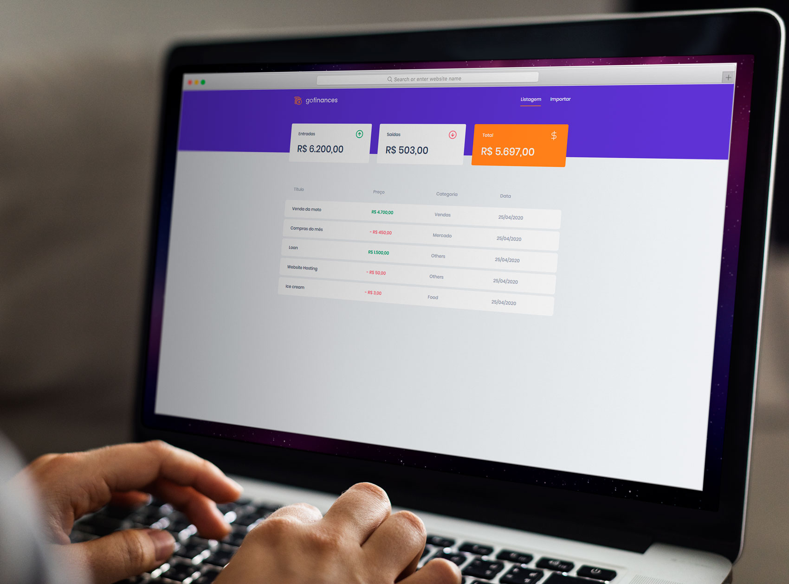

<h3 align="center">
  Challenge 07: React.js Foundations
</h3>

  

  

  

  <a href="#rocket-about-the-challenge">About the Challenge</a>&nbsp;&nbsp;&nbsp;|&nbsp;&nbsp;&nbsp;
  <a href="#memo-license">License</a>

## :rocket: About the Challenge

This was the seventh challenge for the Go-Stack Bootcamp. It involved the creation of a web app to manage money transactions named GoFinances. The application was built using React.js and Typescript consuming the API created for the [6th challenge](https://github.com/thadeucity/go-stack_challenge_06).

### Technologies
This project was developed with [React.js](https://reactjs.org/) and [Typescript](https://www.typescriptlang.org/)

### Tests

To pass the challenge the project:

- **`should be able to list the total balance inside the cards`**

- **`should be able to list the transactions`**

- **`should be able to navigate to the import page`**

- **`should be able to upload a file`**

## :memo: License

This project is under the MIT license. See the [LICENSE](LICENSE.md) for details.

---

Made with ♥ by Victor Alvarenga :wave: [Get in touch!](https://www.linkedin.com/in/victoralvarenga/)
